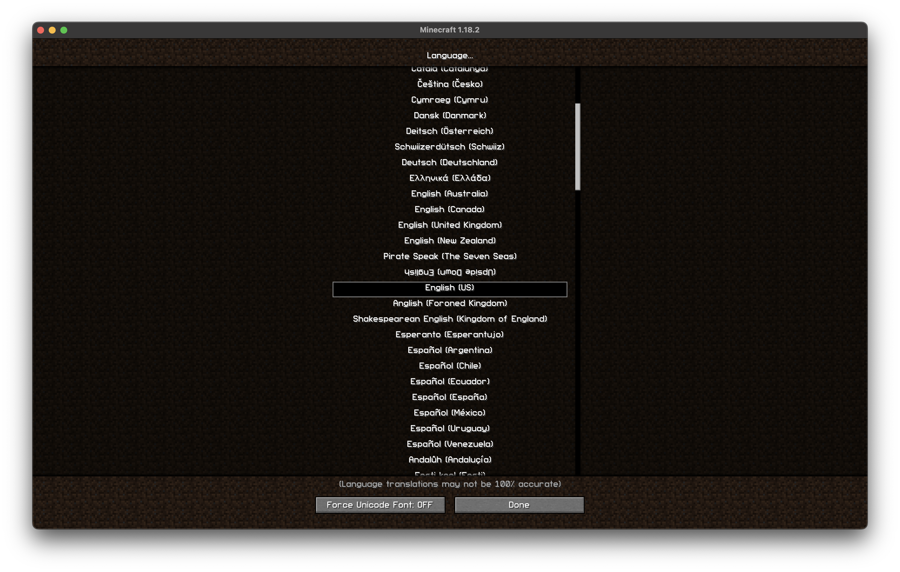
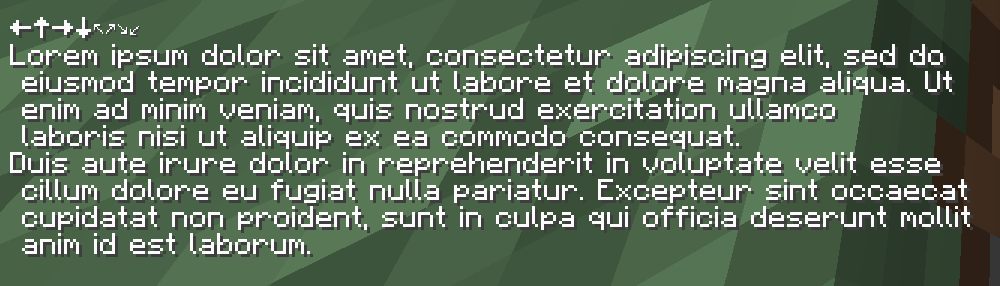
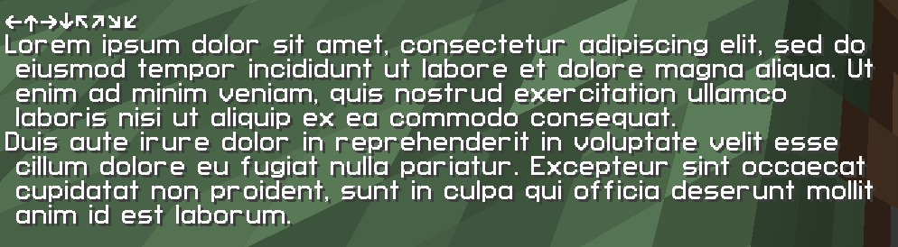

# Takyonik Font Pack

This resource pack is a 32x font pack for Minecraft 1.15.2+.

This is a fork of a now-deleted font pack from `joniksj` for 1.13 and 1.14 that intends to (somewhat) maintain the pack for later versions.

Current version (`v1.2.1`) has been tested to work on Minecraft versions `1.15.2`, `1.18.2`, `1.19`.

To install, you can download this repository and drag the `takyonik-font-pack/` folder inside this repository into the `resourcepacks` folder.

* Note that for versions after 1.16.1, Minecraft will say the pack is outdated. It is not. Feel free to ignore the warning.
* Unless something major happens with font packs in a future version of Minecraft, this resource pack should be mostly functional (for the Unicode range implemented by this pack).
  * For example, `★` should appear properly regardless of which version you run this pack with. If any characters look warbled or totally incorrect, then... whoops.

## ⚠️ Warnings

* In 1.15.2, characters in blackboard bold (`𝟘𝟙𝟚𝟛𝟜𝟝𝟞𝟟𝟠𝟡ℾℽℿℼ⅀𝔸𝔹ℂ𝔻𝔼𝔽𝔾ℍ𝕀𝕁𝕂𝕃𝕄ℕ𝕆ℙℚℝ𝕊𝕋𝕌𝕍𝕎𝕏𝕐ℤ𝕒𝕓𝕔𝕕𝕖𝕗𝕘𝕙𝕚𝕛𝕜𝕝𝕞𝕟𝕠𝕡𝕢𝕣𝕤𝕥𝕦𝕧𝕨𝕩𝕪𝕫`) will not appear properly.
  * These only begin working in 1.16 since UTF-16 was fully implemented in 1.16.
  * These custom textures look bad, so you won't lose much!

## Screenshots

### Font Comparison

